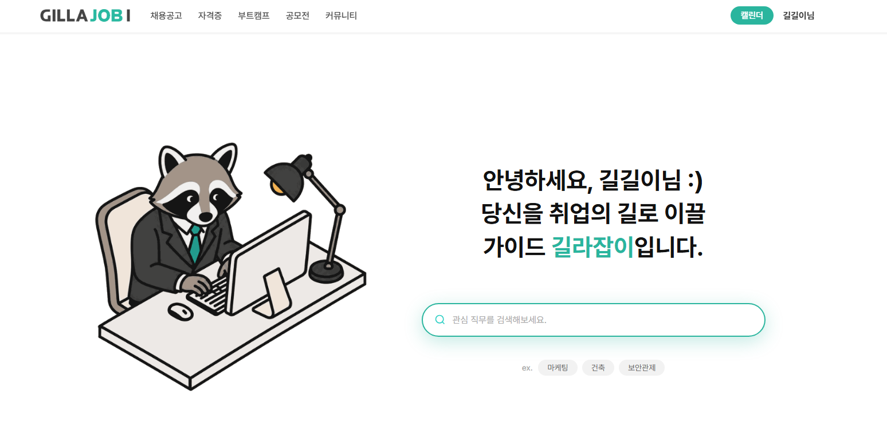
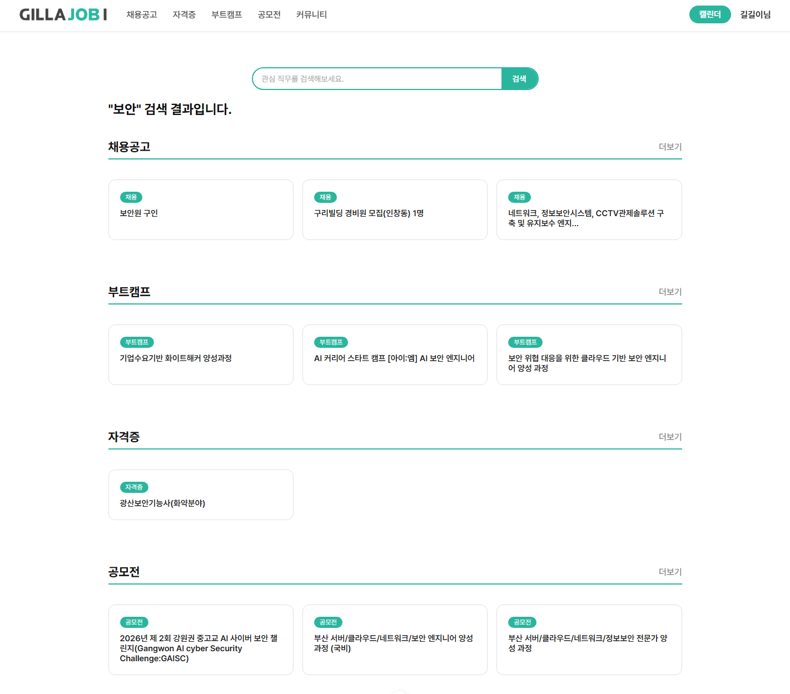
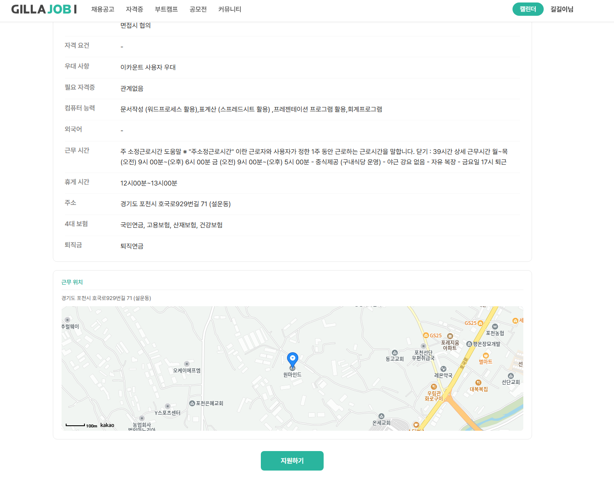
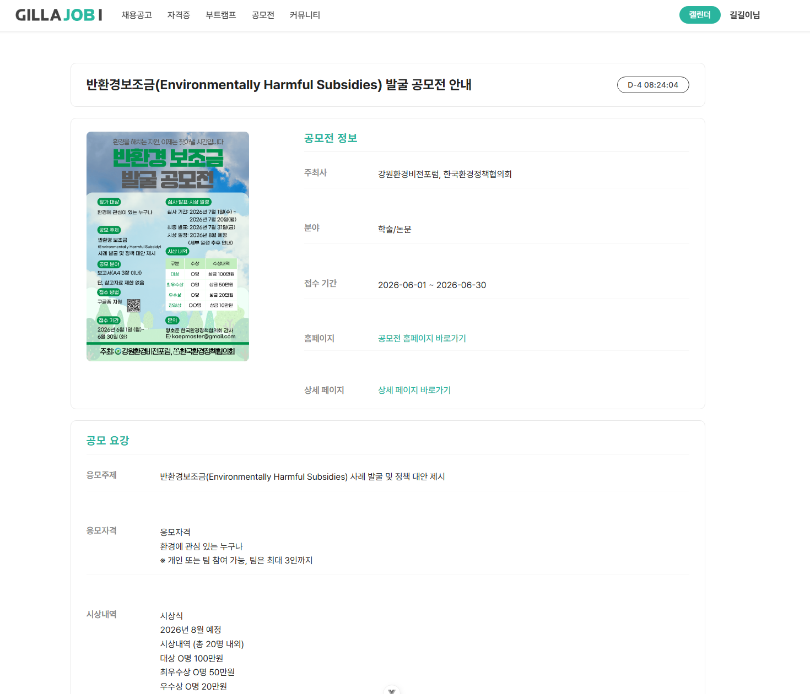
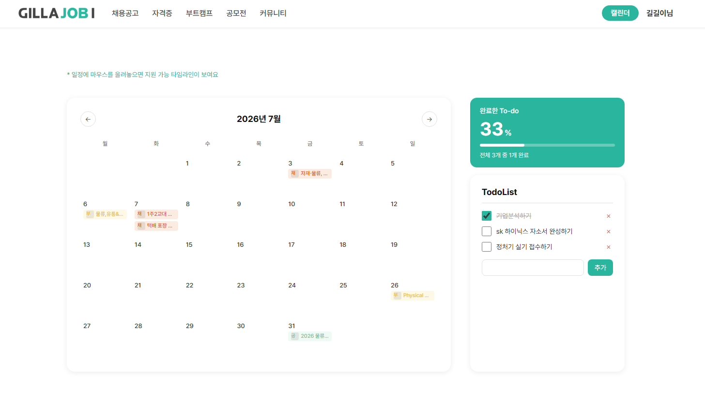
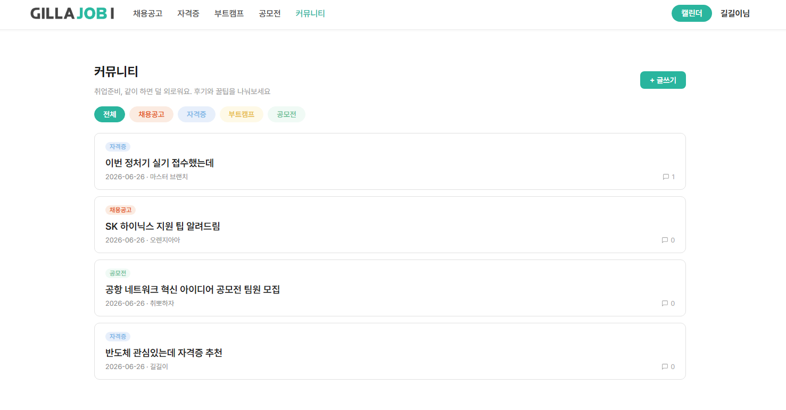
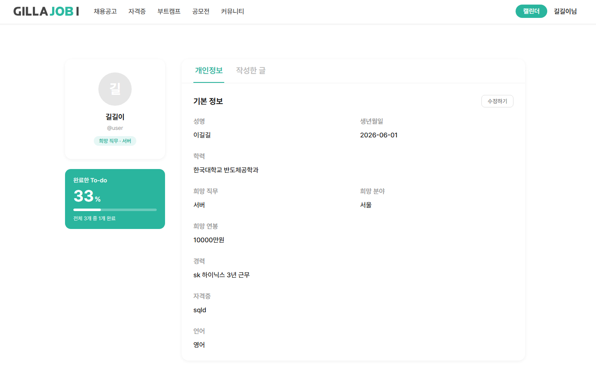
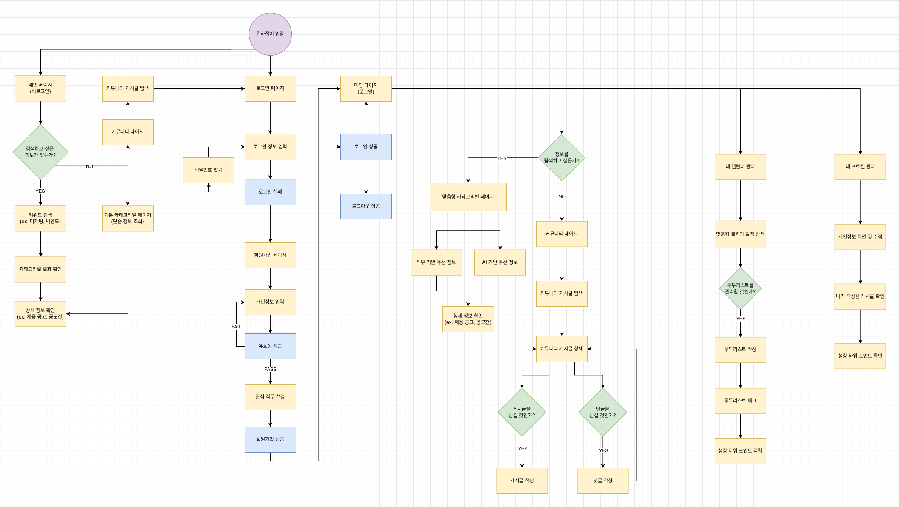
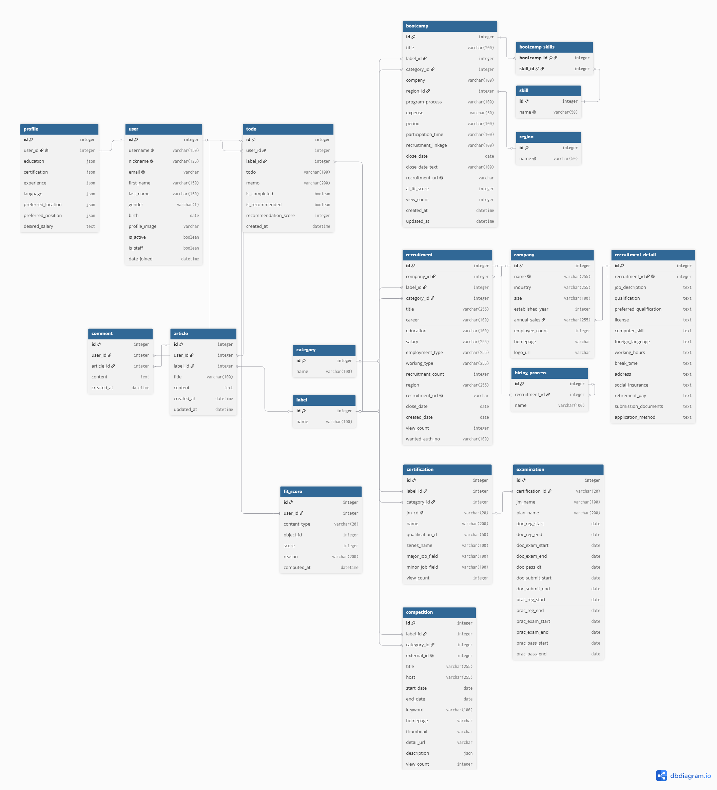

# 길라잡이 (Gillajobi)

> 취업 준비생을 위한 올인원 커리어 가이드 플랫폼

채용공고, 부트캠프, 국가자격증, 공모전 정보를 한 곳에서 확인하고,  
내 프로필을 등록하면 **AI가 나에게 맞는 정보를 자동으로 추천**해드립니다.

## 목차

1. [프로젝트 소개](#1-프로젝트-소개)
2. [서비스 화면](#2-서비스-화면)
3. [주요 기능](#3-주요-기능)
4. [기술 스택](#4-기술-스택)
5. [프로젝트 구조](#5-프로젝트-구조)
6. [유저 플로우](#6-유저-플로우)
7. [ERD](#7-erd)
8. [API 명세](#8-api-명세)
9. [팀원 소개](#9-팀원-소개)
10. [트러블 슈팅](#10-트러블-슈팅)
11. [로컬 실행 방법](#11-로컬-실행-방법)

## 1. 프로젝트 소개

취업 준비를 할 때 채용공고는 A 사이트, 부트캠프는 B 사이트, 자격증은 C 사이트...  
정보가 여기저기 흩어져 있어 불편했던 경험, 있지 않으신가요?

**길라잡이**는 이런 불편함을 해소하기 위해 만든 서비스입니다.  
취업 준비에 필요한 모든 정보를 한 곳에 모아두고, AI가 나의 프로필을 분석해 가장 적합한 공고를 추천해드립니다.

## 2. 서비스 화면

| 메인 화면 | 통합 검색 |
|-----------|-----------|
|  |  |

| 채용공고 목록 | AI 맞춤 추천 |
|--------------|-------------|
|  | |

| 부트캠프 | 자격증 |
|---------|--------|
| | |

| 공모전 | 캘린더 & 투두 |
|-------|-------------|
|  |  |

| 커뮤니티 | 내 프로필 |
|---------|---------|
|  |  |

## 3. 주요 기능

### 통합 검색
관심 직무 키워드 하나로 채용공고·부트캠프·자격증·공모전 결과를 한 화면에서 모아 확인할 수 있습니다.  
AI가 검색어를 관련 키워드로 확장해 더 폭넓은 결과를 찾아줍니다.

### 채용공고
기업 규모, 직무, 경력, 고용형태, 급여 등 상세 정보를 제공하며, 카카오맵으로 근무지 위치도 바로 확인할 수 있습니다.

### 부트캠프
모집 기간, 지역, 기술 스택, 비용, 과정 방식 등 부트캠프 정보를 한눈에 비교할 수 있습니다.

### 국가자격증
국가기술자격 종목별로 회차별 필기·실기 시험 접수 기간과 합격 발표일을 확인할 수 있습니다.

### 공모전
분야별 공모전 목록과 접수 기간, 주최사 정보를 제공합니다.

### AI 맞춤 추천
내 프로필(희망 직무, 경력, 학력, 보유 자격증, 선호 지역)을 등록하면  
Claude AI가 적합도를 0~100점으로 계산해 나에게 맞는 채용공고·부트캠프·자격증·공모전을 추천해드립니다.  
점수와 함께 추천 이유도 확인할 수 있어요.

### 캘린더 & 투두
지원 일정을 캘린더에 등록하고, 투두 리스트로 준비해야 할 할 일을 관리할 수 있습니다.

### 커뮤니티
다른 취준생들과 취업 정보와 경험을 나눌 수 있는 게시판입니다.  
카테고리별로 글을 분류해 원하는 정보를 쉽게 찾을 수 있습니다.

### 최신 뉴스
메인 화면에서 최신 취업·IT 뉴스를 슬라이드로 확인할 수 있습니다.

## 4. 기술 스택

### Frontend
| 항목 | 기술 |
|------|------|
| Framework | Vue 3 |
| Build Tool | Vite 8 |
| 상태관리 | Pinia |
| 라우팅 | Vue Router 5 |
| HTTP 통신 | Axios |
| 스타일 | SCSS |
| 폰트 | Pretendard |

### Backend
| 항목 | 기술 |
|------|------|
| Framework | Django 5.2 |
| REST API | Django REST Framework 3.17 |
| 인증 | dj-rest-auth, django-allauth (Token 기반) |
| CORS | django-cors-headers |
| 크롤링 | BeautifulSoup4, Requests |

### AI
| 항목 | 기술 |
|------|------|
| 모델 | Claude Haiku (Anthropic) |
| 활용 | 검색 키워드 확장 / 사용자 프로필 기반 적합도 점수 계산 |

### 외부 API
| API | 용도 |
|-----|------|
| KakaoMap API | 채용공고 근무지 지도 표시 |
| Q-Net API | 국가기술자격 종목·시험 일정 데이터 수집 |
| 씽유 크롤링 | 공모전 목록 수집 |
| NewsAPI | 메인 화면 최신 뉴스 제공 |

### DB
| 항목 | 기술 |
|------|------|
| 데이터베이스 | SQLite |

## 5. 프로젝트 구조

```
gillajobi/
├── backend/
│   ├── accounts/           # 회원가입 · 로그인 · 프로필
│   ├── ai_score/           # AI 적합도 점수 계산 및 추천
│   ├── bootcamps/          # 부트캠프 정보
│   ├── category/           # 직무 카테고리 · 라벨 · AI 검색
│   ├── certifications/     # 자격증 · 시험 일정
│   ├── community/          # 게시글 · 댓글
│   ├── competitions/       # 공모전 (크롤링 포함)
│   ├── jobs/               # 채용공고
│   ├── todos/              # 투두 리스트
│   ├── gillajobi/          # 프로젝트 설정 (settings, urls)
│   ├── fixtures/           # 초기 데이터 (total.json)
│   ├── requirements.txt
│   └── manage.py
│
└── frontend/
    ├── src/
    │   ├── assets/
    │   ├── components/
    │   │   ├── accounts/       # 프로필 컴포넌트
    │   │   ├── bootcamps/      # 부트캠프 목록 · 상세
    │   │   ├── calendar/       # 캘린더 · 투두
    │   │   ├── certifications/ # 자격증 목록 · 상세
    │   │   ├── common/         # 공통 컴포넌트 (네비게이션, AI 추천, 뉴스 등)
    │   │   ├── community/      # 게시글 · 댓글
    │   │   ├── competitions/   # 공모전 목록 · 상세
    │   │   └── jobs/           # 채용공고 목록 · 상세 (카카오맵)
    │   ├── router/             # Vue Router 설정
    │   ├── stores/             # Pinia 스토어
    │   └── views/              # 페이지 단위 뷰
    ├── index.html
    └── package.json
```

## 6. 유저 플로우



## 7. ERD



**주요 모델 관계 요약**

- `User` ↔ `Profile` : 1:1 (희망 직무, 경력, 학력, 선호 지역 등)
- `User` → `Article`, `Comment`, `Todo` : 1:N
- `Bootcamp`, `Recruitment`, `Certification`, `Competition` → `Category`, `Label` : N:1
- `Bootcamp` ↔ `Skill` : N:M
- `FitScore` : 사용자별 콘텐츠 AI 적합도 점수 저장 (user × content_type × object_id)
- `Certification` → `Examination` : 1:N (회차별 시험 일정)
- `Recruitment` → `RecruitmentDetail`, `HiringProcess` : 1:1, 1:N

## 8. API 명세

**Base URL**: `http://127.0.0.1:8000/api/v1`

| 도메인 | 엔드포인트 | 주요 기능 |
|--------|------------|-----------|
| 계정 | `/accounts/` | 회원가입, 로그인, 로그아웃, 프로필 조회·수정 |
| AI 추천 | `/ai_score/` | 카테고리별 맞춤 추천 3건, 단건 적합도 점수 조회 |
| 채용공고 | `/jobs/` | 목록 조회 (지역 필터), 상세 조회 |
| 부트캠프 | `/bootcamps/` | 목록 조회 (지역·카테고리 필터), 상세 조회 |
| 자격증 | `/certifications/` | 목록 조회, 상세 + 시험 일정 조회 |
| 공모전 | `/competitions/` | 목록 조회, 상세 조회 |
| 커뮤니티 | `/community/` | 게시글 CRUD, 댓글 작성·삭제 |
| 투두 | `/todos/` | 할일 목록 조회, 생성, 수정, 삭제 |
| 통합 검색 | `/category/search/` | AI 키워드 확장 후 4개 카테고리 동시 검색 |

## 9. 팀원 소개

| 이름 | 역할 | GitHub |
|------|------|--------|
| 장혜진 | 팀장 | [GitHub](https://github.com/huizhenz) |
| 정민지 | 팀원 | [GitHub](https://github.com/wjdalswl-airair) |

## 10. 트러블 슈팅

### 이슈 제목
**문제**

**원인**

**해결**

## 11. 로컬 실행 방법

### 사전 요구 사항

- Python 3.10 이상
- Node.js 20.19.0 이상

### 백엔드 실행

```bash
# 1. 백엔드 디렉터리 이동
cd backend

# 2. 가상환경 생성 및 활성화
python -m venv venv

# Windows
venv\Scripts\activate
# macOS / Linux
source venv/bin/activate

# 3. 패키지 설치
pip install -r requirements.txt

# 4. 환경변수 설정 — backend/.env 파일 생성
GMS_KEY=<Claude AI GMS API 키>
NEWS_API_KEY=<뉴스 API 키>
SERVICE_KEY=<Q-Net 서비스 키>
CER_API_URL=http://openapi.q-net.or.kr/api/service/rest/InquiryListNationalQualifcationSVC/getList
EXAM_API_URL=http://openapi.q-net.or.kr/api/service/rest/InquiryTestInformationNTQSVC/getJMList

# 5. DB 마이그레이션
python manage.py migrate

# 6. 초기 데이터 로드 (선택)
python manage.py loaddata ../fixtures/total.json --exclude contenttypes --exclude auth.Permission

# 7. 서버 실행
python manage.py runserver
```

### 프론트엔드 실행

```bash
# 1. 프론트엔드 디렉터리 이동
cd frontend

# 2. 환경변수 설정 — frontend/.env 파일 생성
VITE_KAKAO_API_KEY=<카카오맵 API 키>

# 3. 패키지 설치
npm install

# 4. 개발 서버 실행
npm run dev
```

> 기본 실행 주소: `http://localhost:5173`
